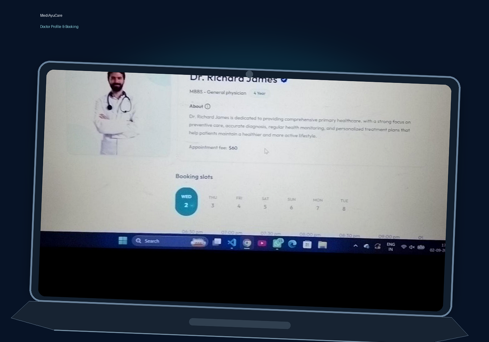
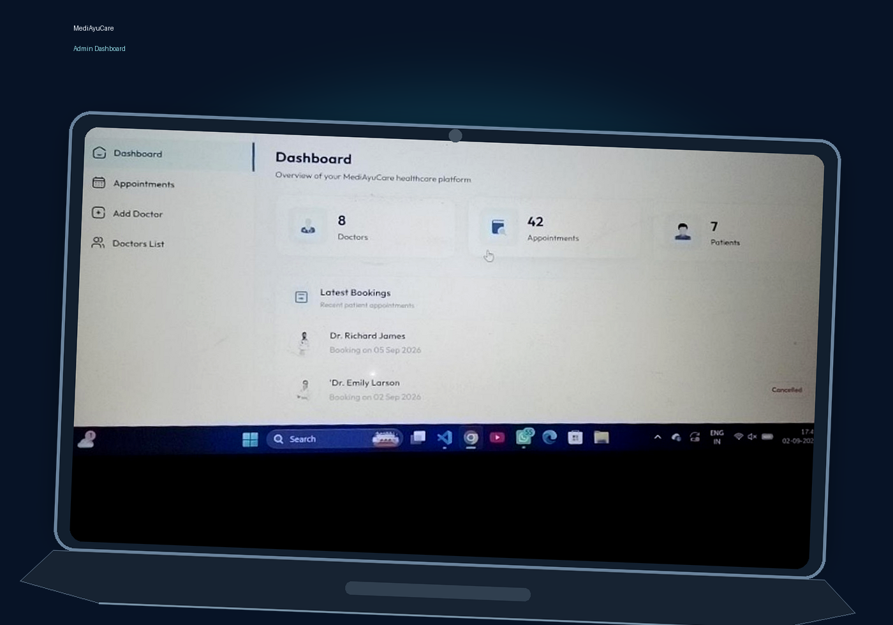

# 🏥 MediAyuCare

> A full-stack healthcare appointment platform connecting patients,
> doctors, and administrators through secure appointment booking,
> payments, and role-based dashboards.

[](https://mediayucare-health-ally.vercel.app)
[](https://mediayucare-admin.vercel.app)
[](https://mediayucare-health-ally.onrender.com)

## 🌐 Live Demo

-   **Patient Website:** https://mediayucare-health-ally.vercel.app
-   **Admin & Doctor Panel:** https://mediayucare-admin.vercel.app
-   **Backend API:** https://mediayucare-health-ally.onrender.com

## 📖 Overview

MediAyuCare is a full-stack healthcare appointment platform built to
simplify the process of discovering doctors, booking appointments,
managing schedules, and handling payments.

The idea came from my own experience while trying to book a healthcare
appointment online at **AIIMS Patna**, where I realized the value of a
convenient and organized digital appointment system. This motivated me
to build MediAyuCare as a practical full-stack project focused on
solving a real-world problem.

The platform provides dedicated experiences for **Patients, Doctors, and
Administrators**, with authentication, role-based access, appointment
management, online/cash payments, doctor availability, and
administrative controls.

## ✨ Key Features

### 👤 Patient

-   Secure authentication and personalized dashboard.
-   Search and filter doctors by speciality.
-   View doctor profiles, fees, experience, and availability.
-   Book, view, and cancel appointments.
-   Online payment with Razorpay and cash payment option.
-   Manage and update personal profile.
-   Access top doctors, About, and Contact sections.

### 👨‍⚕️ Doctor

-   Secure authentication and dedicated dashboard.
-   View and manage patient appointments.
-   Complete or cancel appointments.
-   Manage professional profile, consultation fee, and availability.
-   Track total appointments, patients, and earnings.

### 🛡️ Admin

-   Secure admin authentication and dashboard.
-   Monitor total doctors, patients, and appointments.
-   Add and manage doctors.
-   Control doctor availability.
-   View and manage all appointments.
-   Monitor platform-level statistics and payment workflows.

### 🔐 Security

-   Protected backend APIs and authenticated requests.
-   JWT-based authentication and role-based authorization.
-   Server-side validation.
-   Sensitive configuration managed through environment variables.
-   Razorpay payment verification performed on the backend.

## 👥 User Roles

MediAyuCare implements role-based access control with three user roles:

  -----------------------------------------------------------------------
  Role                                Main Responsibilities
  ----------------------------------- -----------------------------------
  **Patient**                         Discover doctors, book
                                      appointments, make payments, manage
                                      profile, and track appointments.

  **Doctor**                          Manage appointments, profile,
                                      availability, patients, and
                                      earnings.

  **Admin**                           Manage doctors, appointments,
                                      availability, and platform
                                      statistics.
  -----------------------------------------------------------------------

### 🔒 Role-Based Access

-   JWT tokens authenticate protected requests.
-   Dashboard routes are protected according to the authenticated user's
    role.
-   Patients, doctors, and administrators cannot access dashboards or
    protected resources belonging to another role.

## 🛠️ Tech Stack

### Frontend

-   React.js
-   Tailwind CSS
-   React Router
-   React Redux
-   Axios
-   React Toastify
-   Vite

### Backend

-   Node.js
-   Express.js
-   JWT
-   Multer

### Database & Storage

-   MongoDB
-   Mongoose
-   Cloudinary

### Payments & Deployment

-   Razorpay
-   Vercel
-   Render
-   MongoDB Atlas

## 🔄 Application Workflow

1.  **Authentication** --- Users log in according to their role:
    Patient, Doctor, or Admin.
2.  **Doctor Discovery** --- Patients browse doctors, filter by
    speciality, and review profiles, fees, and availability.
3.  **Appointment Booking** --- Patients select an available doctor,
    date, and time slot.
4.  **Payment** --- Patients choose Razorpay online payment or the
    available cash payment option.
5.  **Appointment Management** --- Patients view and cancel appointments
    when required.
6.  **Doctor Management** --- Doctors manage appointments, availability,
    and appointment status.
7.  **Administration** --- Administrators manage doctors, appointments,
    availability, and platform statistics.

## 📅 Appointment Booking Flow

``` text
Patient
   ↓
Find Doctor
   ↓
View Doctor Profile
   ↓
Select Date & Time
   ↓
Create Appointment
   ↓
Choose Payment Method
   ├── Razorpay → Online Payment
   └── Cash → Cash Payment
   ↓
Appointment Confirmed
   ↓
Doctor Manages Appointment
   ├── Complete → Completed
   └── Cancel → Cancelled
   ↓
Patient Tracks Appointment Status
```

### Appointment Status

-   **Booked** --- Appointment has been successfully scheduled.
-   **Paid** --- Online payment has been successfully completed.
-   **Completed** --- Doctor has completed the appointment.
-   **Cancelled** --- Appointment has been cancelled where applicable.

## 💳 Payment Flow

MediAyuCare supports both online and cash-based appointment payments.

### Razorpay Online Payment

1.  Patient selects an appointment and chooses Razorpay.
2.  The application initiates the payment process.
3.  Payment details are sent to the backend after the transaction.
4.  The backend verifies the Razorpay payment.
5.  The appointment is updated with the verified payment status.

### Cash Payment

1.  Patient selects the cash payment option.
2.  The appointment is created without an online transaction.
3.  The appointment remains available for management by the patient,
    doctor, and administrator.

## 🔌 API Overview

The backend follows a role-based REST API architecture.

  -----------------------------------------------------------------------
  Module                              Responsibilities
  ----------------------------------- -----------------------------------
  **User APIs**                       Registration, authentication,
                                      profile management, appointments,
                                      cancellation, and Razorpay payments

  **Doctor APIs**                     Authentication, doctor listing,
                                      dashboard, appointments, profile
                                      management, and availability

  **Admin APIs**                      Authentication, doctor management,
                                      appointment management,
                                      availability control, and dashboard
                                      statistics
  -----------------------------------------------------------------------

All protected API operations require appropriate authentication and role
authorization.

### Main Route Groups

``` text
/api/user
/api/doctor
/api/admin
```

## 📂 Project Structure

``` text
MediAyuCare/
├── frontend/
│   ├── src/
│   │   ├── assets/
│   │   ├── components/
│   │   ├── context/
│   │   ├── pages/
│   │   ├── App.jsx
│   │   └── main.jsx
│   └── ...
│
├── admin/
│   ├── src/
│   │   ├── assets/
│   │   ├── components/
│   │   ├── context/
│   │   ├── pages/
│   │   │   ├── Admin/
│   │   │   └── Doctor/
│   │   ├── Login.jsx
│   │   ├── App.jsx
│   │   └── main.jsx
│   └── ...
│
├── backend/
│   ├── config/
│   ├── controllers/
│   ├── middlewares/
│   ├── models/
│   ├── routes/
│   ├── constants.js
│   └── server.js
│
└── README.md
```

## ⚙️ Environment Variables

Create the required `.env` files in `backend`, `frontend`, and `admin`.

### Backend

``` env
PORT=your_port
MONGODB_URI=your_mongodb_connection_string

CLOUDINARY_NAME=your_cloudinary_name
CLOUDINARY_API_KEY=your_cloudinary_api_key
CLOUDINARY_SECRET_KEY=your_cloudinary_secret_key

ADMIN_EMAIL=your_admin_email
ADMIN_PASSWORD=your_admin_password

JWT_SECRET=your_jwt_secret

RAZORPAY_KEY_ID=your_razorpay_key_id
RAZORPAY_KEY_SECRET=your_razorpay_key_secret

CURRENCY=your_currency
```

### Frontend

``` env
VITE_BACKEND_URL=your_backend_url
VITE_RAZORPAY_KEY_ID=your_razorpay_key_id
```

### Admin

``` env
VITE_BACKEND_URL=your_backend_url
```

> **Security:** Never commit `.env` files or expose API keys, database
> credentials, passwords, or JWT secrets publicly.

## 💻 Installation & Setup

### 1. Clone Repository

``` bash
git clone <your-repository-url>
cd <your-repository-folder>
```

### 2. Install Dependencies

``` bash
# Backend
cd backend
npm install

# Frontend
cd ../frontend
npm install

# Admin
cd ../admin
npm install
```

### 3. Configure Environment Variables

Create the required `.env` files using the templates above.

### 4. Run Backend

``` bash
cd backend
npm run dev
```

### 5. Run Frontend

``` bash
cd frontend
npm run dev
```

### 6. Run Admin Panel

``` bash
cd admin
npm run dev
```

Run the three applications simultaneously in separate terminals during
local development.

## 🚀 Deployment

The project uses a monorepo deployment setup:

``` text
GitHub Repository
       │
       ├── frontend/ ──→ Vercel
       │
       ├── admin/ ─────→ Vercel
       │
       └── backend/ ───→ Render
```

The deployed services are connected to the GitHub repository for
automatic deployment when changes are pushed to the main branch.

``` text
VS Code
   ↓
git add .
   ↓
git commit
   ↓
git push origin main
   ↓
GitHub
   ↓
Vercel / Render
   ↓
Live Application Updated
```

## 📸 Screenshots

### 🏠 1. Patient Home


The landing page provides patients with a clear entry point to discover
doctors and book healthcare appointments.

### 🔎 2. Doctor Discovery


Patients can browse doctors and filter them according to medical
speciality.

### 👨‍⚕️ 3. Doctor Profile & Booking



Patients can view doctor information, consultation fees, available
dates, and booking slots.

### 📋 4. My Appointments


Patients can view appointment details, payment options, status, and
cancellation actions.

### 📊 5. Doctor Dashboard


Doctors can monitor earnings, appointments, unique patients, latest
bookings, and appointment status.

### 🛡️ 6. Admin Dashboard



Administrators can monitor doctors, appointments, patients, and recent
platform activity.

## 📱 Responsive Design

MediAyuCare is designed to provide a responsive and user-friendly
experience across desktop, tablet, and mobile screen sizes.

## 🧪 Testing

The major application workflows were manually tested after deployment,
including:

-   Patient registration and login.
-   Doctor discovery and filtering.
-   Appointment booking and cancellation.
-   Online and cash payment workflows.
-   Doctor dashboard and appointment management.
-   Admin dashboard and management features.
-   Role-based access and protected routes.

## ⚙️ Technical Highlights

-   JWT authentication with role-based authorization.
-   Protected backend APIs.
-   Server-side validation.
-   Backend verification of Razorpay payments.
-   MongoDB and Mongoose for persistent data management.
-   Cloudinary for image storage.
-   RESTful APIs built with Express.js.
-   Environment variables for sensitive configuration.
-   Separate patient, doctor, and admin experiences.

## 🚀 Future Enhancements

-   💬 Doctor--Patient Chat
-   📹 Video Consultation
-   📄 Digital Prescriptions
-   🗂️ Medical Records
-   ⭐ Doctor Reviews & Ratings

## 🤝 Contributing

Contributions, suggestions, and improvements are welcome.

1.  Fork the repository.
2.  Create a new branch.
3.  Make your changes.
4.  Commit and push your changes.
5.  Open a Pull Request.

## 📄 License

This project is licensed under the **MIT License**.

## 👨‍💻 Author

**Ayush Ranjan**

-   GitHub: https://github.com/ayushbhardwaj96
-   LinkedIn: https://linkedin.com/in/ayush-ranjan-a2ab3a368

------------------------------------------------------------------------

```{=html}
<p align="center">
```
Built with ❤️ by Ayush Ranjan
```{=html}
</p>
```
