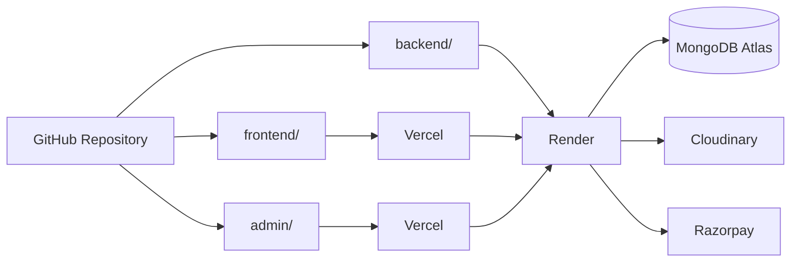
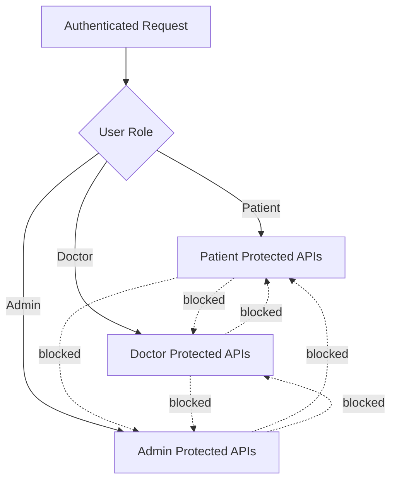
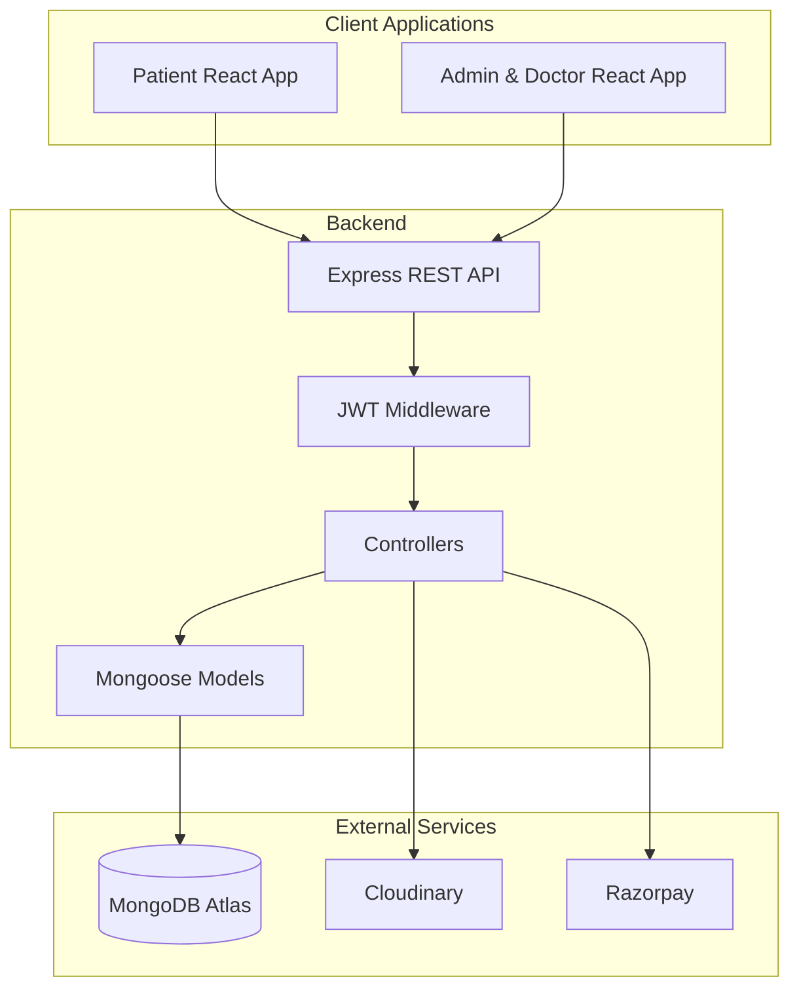
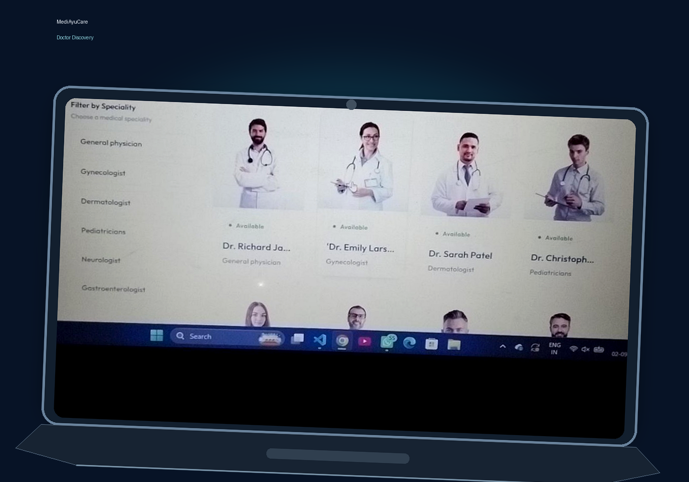
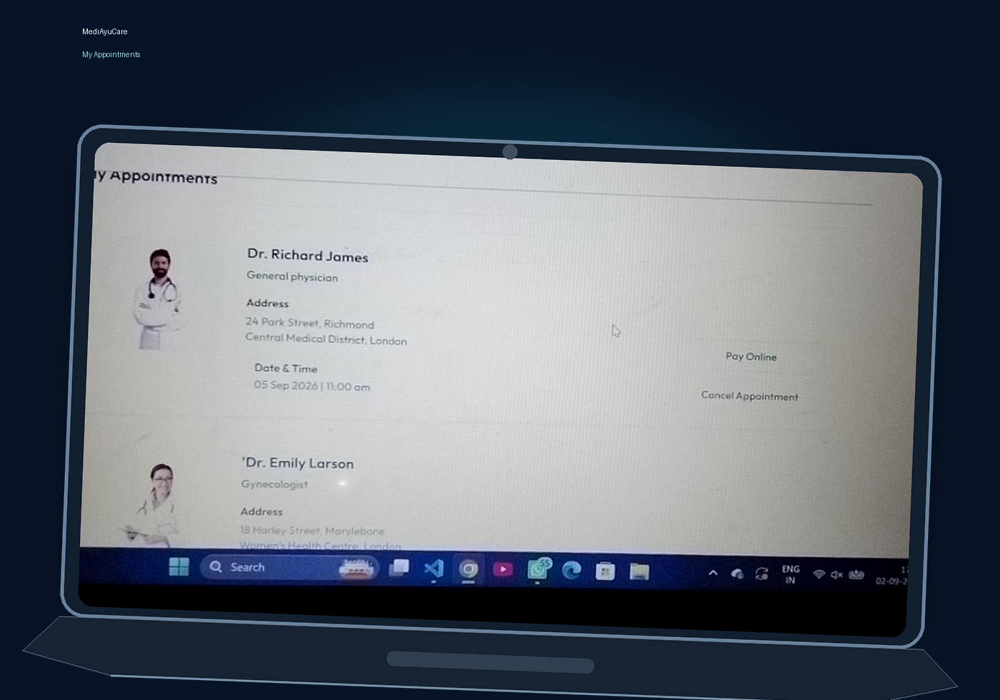
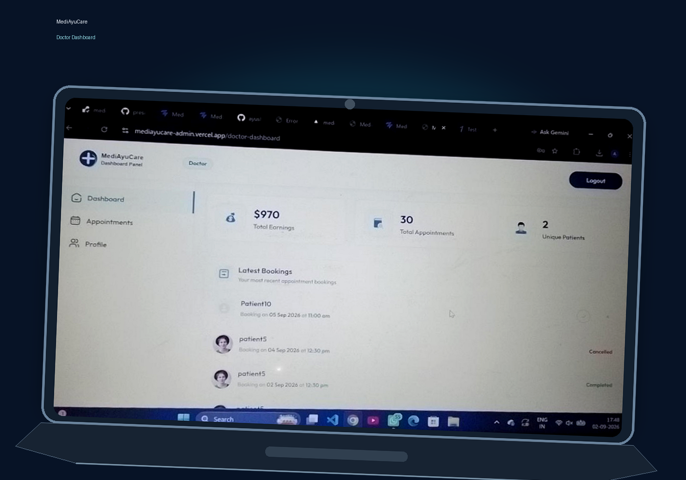

<div align="center">

# 🏥 MediAyuCare

### **Your Health Ally**

A production-style **full-stack healthcare appointment platform** that connects patients, doctors, and administrators through secure authentication, doctor discovery, appointment booking, payments, and role-based dashboards.

<p>
  <a href="https://mediayucare-health-ally.vercel.app"></a>
  <a href="https://mediayucare-admin.vercel.app"></a>
  <a href="https://mediayucare-health-ally.onrender.com"></a>
</p>

<p>
  
  
  
  
  
  
</p>

</div>

---

## 🎨 Project Overview

<p align="center">
  
</p>

> **MediAyuCare** was created around a simple real-world problem: making healthcare appointment booking more organized and convenient for patients while giving doctors and administrators the tools needed to manage appointments efficiently.

The idea was inspired by my experience while trying to book a healthcare appointment online at **AIIMS Patna**. That experience highlighted how useful a well-organized digital appointment system could be and motivated me to build MediAyuCare as a practical, resume-oriented full-stack project.

### What the platform solves

| User | Problem Solved | Platform Support |
|---|---|---|
| 👤 **Patient** | Finding doctors and managing appointments | Doctor discovery, profiles, slots, booking, payments and appointment history |
| 👨‍⚕️ **Doctor** | Managing appointments and availability | Dashboard, appointments, profile, fee, availability, earnings and patients |
| 🛡️ **Admin** | Managing the overall platform | Doctors, appointments, availability, statistics and payment workflow |

---

## 🌐 Live Application

| Application | Link |
|---|---|
| 🌐 **Patient Website** | [Open MediAyuCare](https://mediayucare-health-ally.vercel.app) |
| 🛡️ **Admin & Doctor Panel** | [Open Dashboard Panel](https://mediayucare-admin.vercel.app) |
| ⚙️ **Backend API** | [Open Backend](https://mediayucare-health-ally.onrender.com) |

### 🚀 Deployment Architecture



**Automatic deployment:** changes pushed to the `main` branch can trigger new deployments on the connected Vercel and Render services.

---

## ✨ Core Features

### 👤 Patient Experience

- 🔐 Secure registration and login.
- 🔎 Search and filter doctors by speciality.
- 👨‍⚕️ View doctor profiles, experience, fees and availability.
- 📅 Select available dates and time slots.
- 📝 Book appointments.
- 💳 Pay online through Razorpay.
- 💵 Choose the available cash payment option.
- ❌ Cancel appointments when applicable.
- 👤 Update personal profile.
- 📋 View appointment history.
- 🏠 Access Top Doctors, About and Contact sections.

### 👨‍⚕️ Doctor Experience

- 🔐 Secure doctor authentication.
- 📊 Dedicated doctor dashboard.
- 📅 View latest and upcoming appointments.
- ✅ Complete appointments.
- ❌ Cancel appointments.
- 👤 Update professional profile.
- 💰 Manage consultation fee.
- 🕐 Control availability.
- 📈 Track earnings.
- 👥 Track appointments and unique patients.

### 🛡️ Admin Experience

- 🔐 Secure administrator authentication.
- 📊 Platform dashboard.
- 👨‍⚕️ Add doctors.
- 📋 View and manage doctor list.
- 📅 View and manage appointments.
- 🟢 Control doctor availability.
- 👥 Monitor total patients.
- 💳 Monitor appointment/payment workflow.
- 📈 View platform-level statistics.

---

## 🔐 Security & Access Control

Security is implemented as a core part of the application rather than only a UI feature.

### Authentication

```text
User Login
    ↓
Credentials Verified
    ↓
JWT Token Generated
    ↓
Token Sent With Protected Requests
    ↓
Backend Authentication Middleware
    ↓
Authorized Resource
```

### Role-Based Authorization



Implemented security mechanisms include:

- JWT-based authentication.
- Protected backend APIs.
- Role-based authorization.
- Server-side validation.
- Environment variables for sensitive configuration.
- Backend verification of Razorpay payments.

---

## 🔄 How MediAyuCare Works

```text
┌──────────────┐
│ Authentication│
└──────┬───────┘
       ↓
┌──────────────┐
│ Find Doctor  │
└──────┬───────┘
       ↓
┌──────────────┐
│ Doctor Profile│
└──────┬───────┘
       ↓
┌──────────────┐
│ Select Slot  │
└──────┬───────┘
       ↓
┌──────────────┐
│Book Appointment│
└──────┬───────┘
       ↓
 ┌───────────────┐
 │ Payment Choice│
 └───────┬───────┘
       ↙   ↘
  Razorpay  Cash
       ↘   ↙
       ↓
┌──────────────┐
│ Appointment  │
│   Confirmed  │
└──────┬───────┘
       ↓
┌────────────────┐
│ Doctor Manages │
└──────┬─────────┘
       ↓
 Complete / Cancel
       ↓
┌────────────────┐
│ Patient Tracks │
│     Status     │
└────────────────┘
```

### 📌 Appointment Lifecycle

| Status | Meaning |
|---|---|
| 🟢 **Booked** | Appointment has been successfully scheduled |
| 💳 **Paid** | Online payment has been successfully verified |
| ✅ **Completed** | Doctor has completed the appointment |
| 🔴 **Cancelled** | Appointment has been cancelled where applicable |

---

## 💳 Payment Architecture

MediAyuCare supports **Razorpay online payment** as well as the available **cash payment** workflow.

### Razorpay

```text
Patient
   ↓
Create Appointment
   ↓
Start Razorpay Payment
   ↓
Payment Completed
   ↓
Payment Details → Backend
   ↓
Razorpay Verification
   ↓
Verified Payment
   ↓
Appointment Payment Status Updated
```

The important security point is that the application does **not rely only on the client-side payment result**. The payment is verified through the backend before the appointment is updated as paid.

### Cash

```text
Patient
   ↓
Create Appointment
   ↓
Choose Cash
   ↓
Appointment Created
   ↓
Available for Patient / Doctor / Admin Management
```

---

## 🧩 System Architecture



### Architecture Responsibilities

- **React** → user interfaces and client-side interaction.
- **Express.js** → REST API layer.
- **JWT middleware** → authentication and role authorization.
- **Controllers** → application/business operations.
- **Mongoose** → database models and MongoDB communication.
- **MongoDB Atlas** → persistent application data.
- **Cloudinary** → image storage.
- **Razorpay** → online appointment payments.
- **Vercel / Render** → application deployment.

---

## 🛠️ Technology Stack

### Frontend

| Technology | Purpose |
|---|---|
| React.js | UI development |
| React Router | Client-side routing |
| Tailwind CSS | Responsive styling |
| React Redux | State management |
| Axios | API communication |
| React Toastify | User notifications |
| Vite | Frontend build tooling |

### Backend

| Technology | Purpose |
|---|---|
| Node.js | Server runtime |
| Express.js | REST API framework |
| JWT | Authentication |
| Multer | File upload handling |

### Data & Services

| Technology | Purpose |
|---|---|
| MongoDB | Database |
| Mongoose | ODM |
| Cloudinary | Image storage |
| Razorpay | Payment processing |
| Vercel | Frontend/Admin deployment |
| Render | Backend deployment |

---

## 🔌 API Overview

The backend is organized into separate role-based API modules.

| API Module | Main Responsibilities |
|---|---|
| `/api/user` | Registration, login, profile, appointments, cancellation and Razorpay payment |
| `/api/doctor` | Doctor listing, login, dashboard, appointments, profile and availability |
| `/api/admin` | Admin login, doctor management, appointments, availability and dashboard |

### Main User Operations

```text
POST  /register
POST  /login
GET   /get-profile
POST  /update-profile
POST  /book-appointment
GET   /appointments
POST  /cancel-appointment
POST  /payment-razorpay
POST  /verifyRazorpay
```

### Main Doctor Operations

```text
GET   /list
POST  /login
GET   /appointments
POST  /cancel-appointment
POST  /complete-appointment
GET   /dashboard
GET   /profile
POST  /update-profile
POST  /change-availability
```

### Main Admin Operations

```text
POST  /add-doctor
POST  /login
POST  /all-doctors
POST  /change-availability
GET   /appointments
POST  /cancel-appointment
GET   /dashboard
```

> All protected operations require the appropriate authentication and role authorization.

---

## 📁 Project Structure

```text
MediAyuCare/
│
├── frontend/                         # Patient-facing React application
│   ├── src/
│   │   ├── assets/
│   │   ├── components/
│   │   ├── context/
│   │   ├── pages/
│   │   ├── App.jsx
│   │   └── main.jsx
│   └── ...
│
├── admin/                            # Admin & Doctor React application
│   ├── src/
│   │   ├── assets/
│   │   ├── components/
│   │   ├── context/
│   │   ├── pages/
│   │   │   ├── Admin/
│   │   │   └── Doctor/
│   │   ├── Login.jsx
│   │   ├── App.jsx
│   │   └── main.jsx
│   └── ...
│
├── backend/                          # Express backend
│   ├── config/
│   │   ├── cloudinary.js
│   │   └── mongodb.js
│   ├── controllers/
│   │   ├── adminController.js
│   │   ├── doctorController.js
│   │   └── userController.js
│   ├── middlewares/
│   │   ├── authAdmin.js
│   │   ├── authDoctor.js
│   │   ├── authUser.js
│   │   └── multer.js
│   ├── models/
│   ├── routes/
│   ├── constants.js
│   └── server.js
│
└── README.md
```

---

## ⚙️ Environment Configuration

Create `.env` files inside the **backend**, **frontend**, and **admin** directories.

### Backend `.env`

```env
PORT=your_port
MONGODB_URI=your_mongodb_connection_string

CLOUDINARY_NAME=your_cloudinary_name
CLOUDINARY_API_KEY=your_cloudinary_api_key
CLOUDINARY_SECRET_KEY=your_cloudinary_secret_key

ADMIN_EMAIL=your_admin_email
ADMIN_PASSWORD=your_admin_password

JWT_SECRET=your_jwt_secret

RAZORPAY_KEY_ID=your_razorpay_key_id
RAZORPAY_KEY_SECRET=your_razorpay_key_secret

CURRENCY=your_currency
```

### Frontend `.env`

```env
VITE_BACKEND_URL=your_backend_url
VITE_RAZORPAY_KEY_ID=your_razorpay_key_id
```

### Admin `.env`

```env
VITE_BACKEND_URL=your_backend_url
```

> ⚠️ **Never commit `.env` files.** Keep database credentials, passwords, JWT secrets, Cloudinary credentials and Razorpay secrets private.

---

## 💻 Local Development

### 1. Clone the repository

```bash
git clone <your-repository-url>
cd <your-repository-folder>
```

### 2. Install dependencies

Open three terminals:

```bash
# Terminal 1 — Backend
cd backend
npm install
npm run dev
```

```bash
# Terminal 2 — Frontend
cd frontend
npm install
npm run dev
```

```bash
# Terminal 3 — Admin / Doctor Panel
cd admin
npm install
npm run dev
```

### 3. Configure environment variables

Add the required values to the `.env` files described above.

---

## 🚀 Production Deployment

MediAyuCare is deployed as a **monorepo**:

```text
                    GitHub
                      │
          ┌───────────┼───────────┐
          ↓           ↓           ↓
      frontend/    admin/     backend/
          │           │           │
          ↓           ↓           ↓
       Vercel      Vercel      Render
          │           │           │
          └───────────┬───────────┘
                      ↓
                 Live Platform
```

### Continuous Deployment

```text
Code Change
    ↓
git add .
    ↓
git commit
    ↓
git push origin main
    ↓
GitHub
    ↓
Vercel / Render Build
    ↓
Production Deployment
```

---

# 📸 Product Showcase

> The following six images are kept **separate** so each major application experience can be viewed independently.

### 01 — 🏠 Patient Home

<p align="center">
  
</p>

The patient landing page introduces the platform and provides direct access to doctor discovery and appointment booking.

---

### 02 — 🔎 Doctor Discovery

<p align="center">
  
</p>

Patients can browse available doctors and narrow the list by medical speciality before selecting a doctor.

---

### 03 — 👨‍⚕️ Doctor Profile & Booking

<p align="center">
  
</p>

The doctor profile presents professional information, consultation fee, available dates and booking slots.

---

### 04 — 📋 My Appointments

<p align="center">
  
</p>

Patients can review appointment details, available payment actions, appointment timing and cancellation options.

---

### 05 — 📊 Doctor Dashboard

<p align="center">
  
</p>

The doctor dashboard summarizes earnings, total appointments, unique patients, recent bookings and appointment status.

---

### 06 — 🛡️ Admin Dashboard

<p align="center">
  
</p>

The admin dashboard provides a platform-level overview of doctors, appointments, patients and recent booking activity.

---

## 🧪 Testing & Verification

After deployment, the major application workflows were manually verified:

- ✅ Patient registration and login.
- ✅ Doctor discovery and speciality filtering.
- ✅ Doctor profile and slot selection.
- ✅ Appointment booking.
- ✅ Razorpay payment flow.
- ✅ Cash payment workflow.
- ✅ Appointment cancellation.
- ✅ Doctor appointment management.
- ✅ Doctor profile and availability management.
- ✅ Admin doctor management.
- ✅ Admin appointment management.
- ✅ Role-based protected routes.
- ✅ Production frontend → backend communication.

---

## 🧠 Technical Highlights

| Area | Implementation |
|---|---|
| 🔐 Authentication | JWT-based authentication |
| 🛡️ Authorization | Patient / Doctor / Admin role separation |
| 🌐 API | REST architecture with Express.js |
| 🗄️ Database | MongoDB + Mongoose |
| ☁️ Image Storage | Cloudinary |
| 💳 Payments | Razorpay with backend verification |
| 🎨 UI | React + Tailwind CSS |
| 📱 UX | Responsive interface |
| 🚀 Deployment | Vercel + Render |
| 🔄 CI/CD | GitHub-connected automatic deployments |

---

## 🗺️ Future Roadmap

The current platform can be extended with:

- 💬 **Doctor–Patient Chat** — direct communication.
- 📹 **Video Consultation** — remote appointments.
- 📄 **Digital Prescriptions** — electronic prescription generation.
- 🗂️ **Medical Records** — centralized patient records.
- ⭐ **Reviews & Ratings** — patient feedback for doctors.

---

## 🤝 Contributing

Contributions and suggestions are welcome.

```text
Fork
  ↓
Create Branch
  ↓
Make Changes
  ↓
Commit
  ↓
Push
  ↓
Pull Request
```

Please keep changes focused and maintain the existing project structure.

---

## 📄 License

This project is licensed under the **MIT License**.

---

## 👨‍💻 Author

<div align="center">

### **Ayush Ranjan**

Full-Stack Developer • MERN Stack

[](https://github.com/ayushbhardwaj96)
[](https://linkedin.com/in/ayush-ranjan-a2ab3a368)

</div>

---

<div align="center">

### 🏥 MediAyuCare
**Your Health Ally**

Built with ❤️, React, Node.js, Express.js and MongoDB.

</div>
